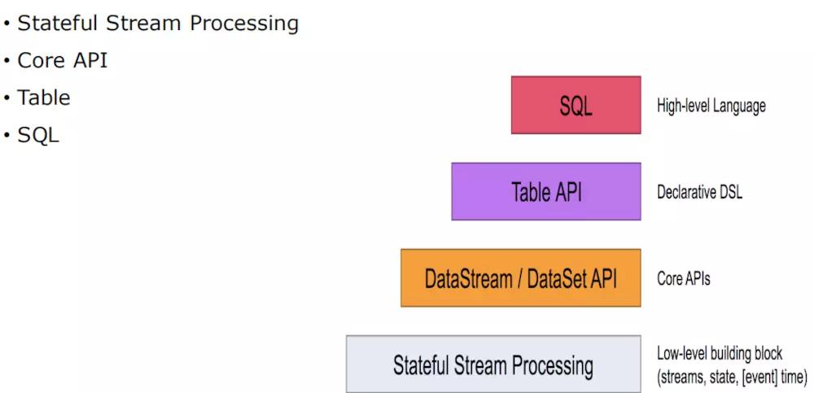
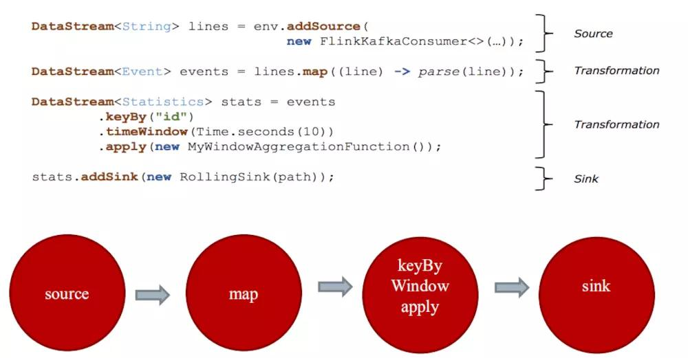
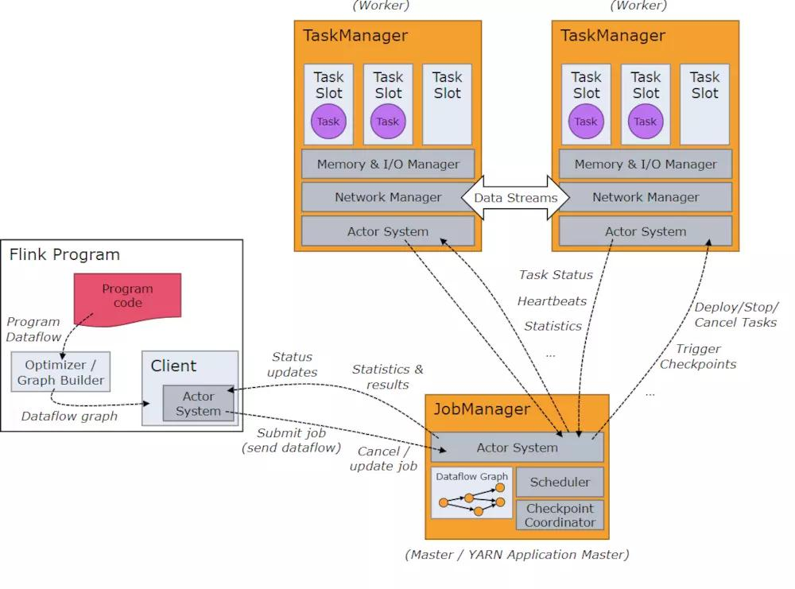
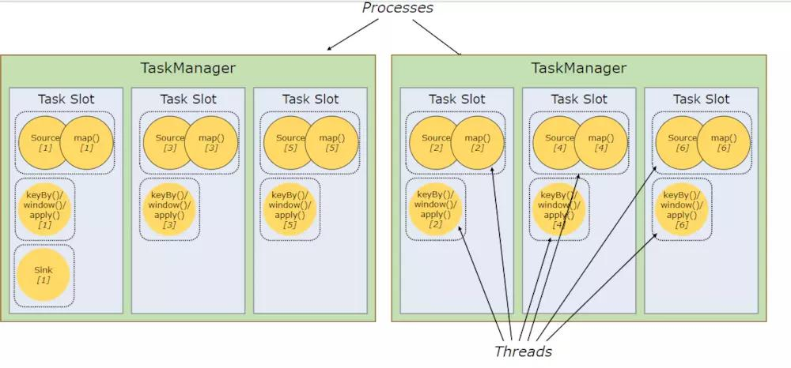
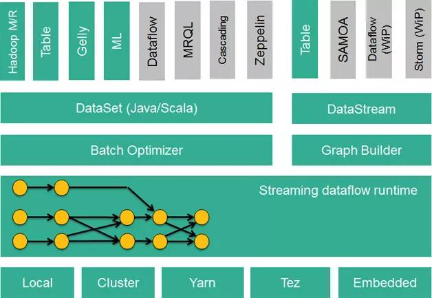

## Flink分层架构

### Stateful Stream Processing

- 状态流进程，是core API的底层实现；
- 定义了丰富的process function;
- 灵活度高，但用法较复杂。

### Core API

- DataStream用于流式处理，DataSet用于批处理；
- Flink的批处理也是基于流处理来进行模拟的，与Spark Streaming完全相反。

DataSet API，对静态数据进行批处理操作，将静态数据抽象成分布式的数据集，用户可以方便地使用Flink提供的各种操作符对分布式数据集进行处理，支持Java、Scala和Python；

DataStream API，对数据流进行流处理操作，将流式的数据抽象成分布式的数据流，用户可以方便地对分布式数据流进行各种操作，支持Java和Scala。

### Table && SQL

- SQL构建在Table之上，不同类型的Table构建不同的Table环境；
- Table可与底层的DataStream或者DataSet相互转化；
- Streaming SQL不同于静态存储表的SQL，最终会转化为流式执行计划。

Table API，对结构化数据进行查询操作，将结构化数据抽象成关系表，并通过类SQL的DSL对关系表进行各种查询操作，支持Java和Scala。

## Flink构建的流程

### 构建计算环境

- 主要决定采取何种计算执行方式(Batch或者Streaming)

### 创建Source

- 支持多种数据源(Kafka、Hbase、Hive、Mysql等)

### 数据转化

- 对数据进行多种不同方式的转换，Flink提供了丰富的算子，并且是基于管道运行的

### 输出(Sink)

- 多结果的数据进行Sink，即输出到指定地方(Kafka、Hbase、Hive、Mysql等)

## Flink运行架构

### Client

- 用于向Flink集群提交计算任务；

### JobManager

- 用于任务调度和checkpoint协调；

### TaskManager

- Worker节点负责Task的执行，Slots用于资源的分割。

## Flink的技术栈

Apache Storm、Apache Smaza只支持流处理任务；

Aapche MapReduce、Apache Tez、Apache Spark只支持批处理任务；

Spark Streaming是Apache Spark之上支持流处理任务的子系统，看似一个特例，实则不然——Spark Streaming采用了一种micro-batch的架构，即把输入的数据流切分成细粒度的batch，并为每一个batch数据提交一个批处理的Spark任务，所以Spark  Streaming本质上还是基于Spark批处理系统对流式数据进行处理。

和Apache Storm、Apache Smaza等完全流式的数据处理方式完全不同。通过其灵活的执行引擎，Flink能够同时支持批处理任务与流处理任务。

### 流批模式

- 流模式

节点间数据传输的标准模型是：当一条数据被处理完成后，序列化到缓存中，然后立刻通过网络传输到下一个节点，由下一个节点继续处理。

- 批模式

当一条数据被处理完成后，序列化到缓存中，并不会立刻通过网络传输到下一个节点，当缓存写满，就持久化到本地硬盘上，当所有数据都被处理完成后，才开始将处理后的数据通过网络传输到下一个节点。

Flink以固定的缓存块为单位进行网络数据传输，用户可以通过缓存块超时值指定缓存块的传输时机。
