## Cluster Standalone

- 下载链接

[https://flink.apache.org/downloads.html](https://flink.apache.org/downloads.html)

> 需要注意对应的Hadoop版本，避免后续因为版本冲突报错。

- 部署

```
# 解压安装包
tar -zxvf flink-1.7.0-bin-hadoop28-scala_2.11.tgz 

# 配置
vim /usr/software/flink/flink-1.7.0/conf/flink-conf.yaml 

# 设置Master
jobmanager.rpc.address:master 
# 每个TaskManager可用的总内存 
taskmanager.heap.mb：2048
# 每台机器上可用CPU的总数 
taskmanager.numberOfTaskSlots：4
# 每个Job运行时默认的并行度
parallelism.default：10
# 临时目录 
taskmanager.tmp.dirs：/tmp
# 每个节点的JVM能够分配的最大内存 
jobmanager.heap.mb：2048
# 这里设置flink的web端口号为8082，因为默认的8081与Spark的Worker节点的Web端口号冲突。
jobmanager.web.port: 8082
jobmanager.rpc.port: 6123

vim /usr/software/flink/flink-1.7.0/conf/masters

master:8082

vim /usr/software/flink/flink-1.7.0/conf/slaves

slave1
slave2
slave3          

```
- 启动Flink集群

```
# 启动集群
cd /usr/software/flink/flink-1.7.0/bin/
./start-cluster.sh 
```
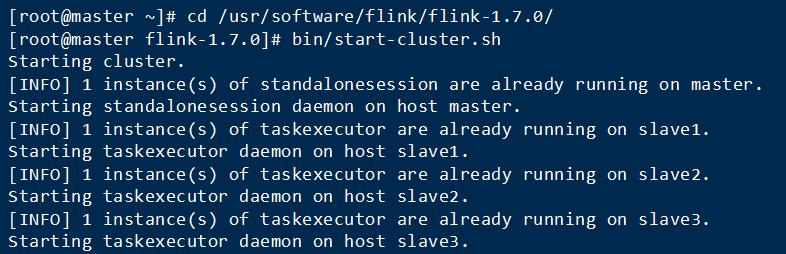

此时，可以jps查看Master节点启动了StandaloneSessionClusterEntrypoint进程，Slave节点启动了TaskManagerRunner进程。


Web界面：master:8082

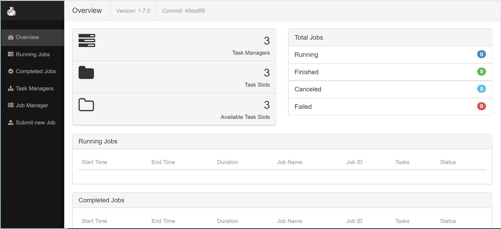

```
# 停止集群
cd /usr/software/flink/flink-1.7.0/bin/
./stop-cluster.sh 
```

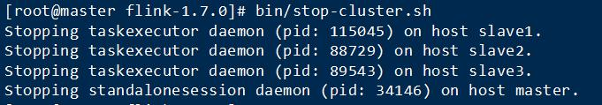


## Flink On YARN

需要注意的是，Flink On YARN必须启动Hadoop集群，仅启动YARN是不行的，还需要启动HDFS。

```
start-yarn.sh
start-dfs.sh
或者
start-all.sh
```

需要注意的是，当Hadoop启动后，不要直接就去启动Flink On YARN，否则会报错：

```
org.apache.flink.client.deployment.ClusterDeploymentException: Couldn't deploy Yarn session cluster
        at org.apache.flink.yarn.AbstractYarnClusterDescriptor.deploySessionCluster(AbstractYarnClusterDescriptor.java:423)
        at org.apache.flink.yarn.cli.FlinkYarnSessionCli.run(FlinkYarnSessionCli.java:607)
        at org.apache.flink.yarn.cli.FlinkYarnSessionCli.lambda$main$2(FlinkYarnSessionCli.java:810)
        at java.security.AccessController.doPrivileged(Native Method)
        at javax.security.auth.Subject.doAs(Subject.java:422)
        at org.apache.hadoop.security.UserGroupInformation.doAs(UserGroupInformation.java:1836)
        at org.apache.flink.runtime.security.HadoopSecurityContext.runSecured(HadoopSecurityContext.java:41)
        at org.apache.flink.yarn.cli.FlinkYarnSessionCli.main(FlinkYarnSessionCli.java:810)
Caused by: org.apache.hadoop.hdfs.server.namenode.SafeModeException: Cannot create file/user/root/.flink/application_1545471521760_0005/log4j.properties. Name node is in safe mode.
The reported blocks 81 has reached the threshold 0.9990 of total blocks 81. The number of live datanodes 3 has reached the minimum number 0. In safe mode extension. Safe mode will be turned off automatically in 9 seconds. NamenodeHostName:master
        at org.apache.hadoop.hdfs.server.namenode.FSNamesystem.newSafemodeException(FSNamesystem.java:1407)
        at org.apache.hadoop.hdfs.server.namenode.FSNamesystem.checkNameNodeSafeMode(FSNamesystem.java:1395)
        at org.apache.hadoop.hdfs.server.namenode.FSNamesystem.startFileInt(FSNamesystem.java:2280)
        at org.apache.hadoop.hdfs.server.namenode.FSNamesystem.startFile(FSNamesystem.java:2225)
        at org.apache.hadoop.hdfs.server.namenode.NameNodeRpcServer.create(NameNodeRpcServer.java:728)
        at org.apache.hadoop.hdfs.protocolPB.ClientNamenodeProtocolServerSideTranslatorPB.create(ClientNamenodeProtocolServerSideTranslatorPB.java:413)
        at org.apache.hadoop.hdfs.protocol.proto.ClientNamenodeProtocolProtos$ClientNamenodeProtocol$2.callBlockingMethod(ClientNamenodeProtocolProtos.java)
        at org.apache.hadoop.ipc.ProtobufRpcEngine$Server$ProtoBufRpcInvoker.call(ProtobufRpcEngine.java:447)
        at org.apache.hadoop.ipc.RPC$Server.call(RPC.java:989)
        at org.apache.hadoop.ipc.Server$RpcCall.run(Server.java:850)
        at org.apache.hadoop.ipc.Server$RpcCall.run(Server.java:793)
        at java.security.AccessController.doPrivileged(Native Method)
        at javax.security.auth.Subject.doAs(Subject.java:422)
        at org.apache.hadoop.security.UserGroupInformation.doAs(UserGroupInformation.java:1844)
        at org.apache.hadoop.ipc.Server$Handler.run(Server.java:2489)

```

原因是此时的Hadoop还在进行各项准备工作，即所谓的处于SafeMode状态，解决的方法很简单，等待片刻，SafeMode结束后，Flink On YARN即可正常启动了。

### 客户端模式

- 启动Flink On YARN

该种模式下，所有任务的执行均在同一个application下，各任务的执行是资源共享的。

客户端会在集群某台机器上启动1个一直运行的YarnSessionClusterEntrypoint进程，然后可通过flink run命令提交任务。

```
./yarn-session.sh -n 4 -jm 1024 -tm 4096

Usage:
   Required
     -n,--container <arg>   为YARN分配容器的数量 (=Number of Task Managers)
   Optional
     -D <property=value>             动态属性 
     -d,--detached                   以分离模式运行作业
     -h,--help                       Yarn session帮助.
     -id,--applicationId <arg>       连接到一个正在运行的YARN session
     -j,--jar <arg>                  Flink jar文件的路径
     -jm,--jobManagerMemory <arg>    JobManager的内存大小，driver-memory [in MB]
     -m,--jobmanager <arg>           Address of the JobManager (master) to which to connect. Use this flag to connect to a different JobManager than the one specified in the configuration.
     -n,--container <arg>            TaskManager的数量，相当于executor的数量
     -nm,--name <arg>                设置YARN应用自定义名称 
     -q,--query                      显示可用的YARN资源 (memory, cores)
     -qu,--queue <arg>               指定YARN队列
     -s,--slots <arg>                每个JobManager的core的数量，executor-cores。建议将slot的数量设置每台机器的处理器数量
     -st,--streaming                 在流模式下启动Flink
     -t,--ship <arg>                 在指定目录中传送文件(t for transfer)
     -tm,--taskManagerMemory <arg>   每个TaskManager的内存大小，executor-memory  [in MB]
     -yd,--yarndetached              如果存在，则以分离模式运行作业 (deprecated; use non-YARN specific option instead)
     -z,--zookeeperNamespace <arg>   为高可用性模式创建Zookeeper子路径的命名空间

```

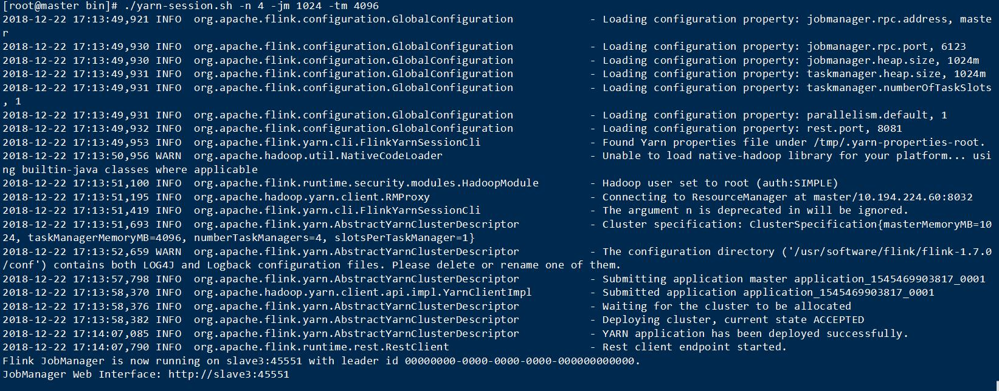

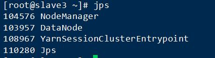

可以看到，YARN在slave3上启动了YarnSessionClusterEntrypoint进程。

打开YARN的管理界面，在Tracking UI标签下点击ApplicationMaster，可以登录Flink的Web控制界面。

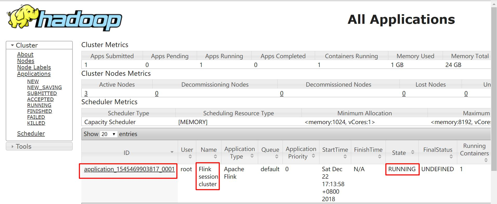

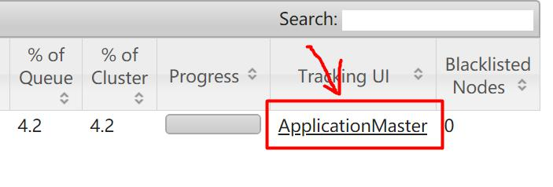

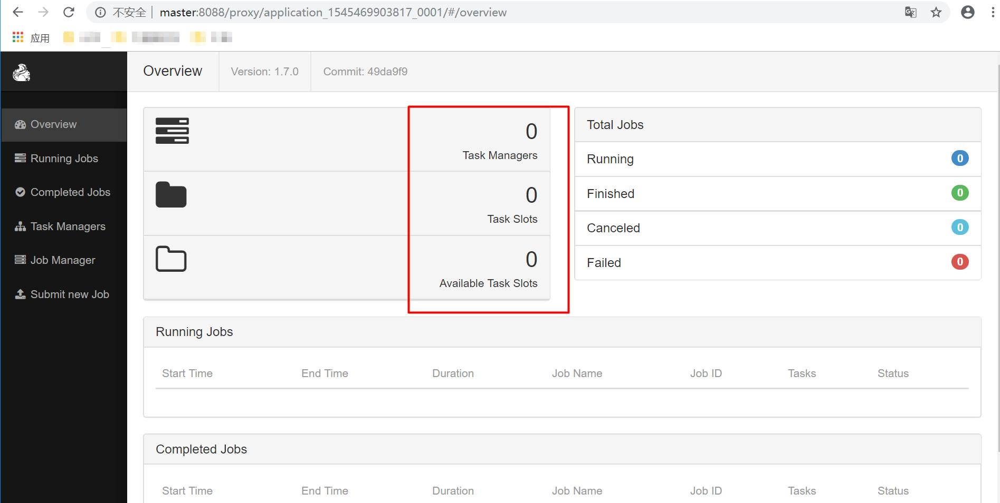

此时，你可能会疑问，我明明启动了4个TaskManager呀，为什么这里显示没有呢？

其实，主要是当Flink任务序列中无任何任务时，YARN不会启动相应的TaskManager进程的。

下面，我们同时提交任务到YARN上，刷新ApplicationMaster页面：

```
[root@master sbin]# cd /usr/software/flink/flink-1.7.0/bin/
[root@master bin]# ./flink run ../examples/batch/WordCount.jar 

用法: run [OPTIONS] <jar-file> <arguments>  
  "run" 操作参数:  
     -c,--class <classname>           如果没有在jar包中指定入口类，则需要在这里通过这个参数指定  

     -m,--jobmanager <host:port>      指定需要连接的jobmanager(主节点)地址  
                                      使用这个参数可以指定一个不同于配置文件中的jobmanager  
     -p,--parallelism <parallelism>   指定程序的并行度。可以覆盖配置文件中的默认值。

```

- 提交任务

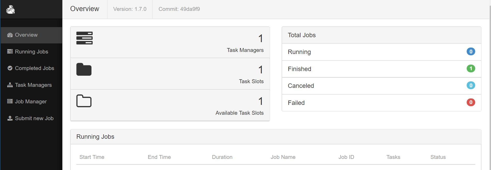

可以看到，当任务提交运行时，YARN开始启动Flink的相关进程，当任务结束后，ApplicationMaster页面的资源页面重新归零。


- 关闭Flink On YARN

关闭Flink On YARN有1种方式，1种是通过Yarn命令优雅的关闭，另外1种是强制关闭。

但是，在Flink On YARN的高可用(HA)模式下，只能通过Yarn命令来关闭，因为第2种方式杀死进程后，Yarn会在集群中重启YarnSessionClusterEntrypoint进程。

**YARN命令关闭**

```
[root@master ~]# cd /usr/software/hadoop2.8.5/hadoop-2.8.5/bin/
[root@master bin]# ls
container-executor  hadoop  hadoop.cmd  hdfs  hdfs.cmd  mapred  mapred.cmd  rcc  test-container-executor  yarn  yarn.cmd
[root@master bin]# ./yarn application -kill <applicationId> 
18/12/25 09:43:19 INFO client.RMProxy: Connecting to ResourceManager at master/10.194.224.60:8032
Killing application <applicationId> 
18/12/25 09:43:20 INFO impl.YarnClientImpl: Killed application <applicationId> 
```

**强制关闭**

CTRL+C强制退出yarn-session客户端进程后，在slave3上执行jps：


可以看到，YarnSessionClusterEntrypoint仍然存在，可通过以下命令停止：

```
[root@slave3 ~]# kill -9 108967 # 108967为YarnSessionClusterEntrypoint的进程号
```

### 任务模式

该种模式下，每上传1个任务，YARN就会创建1个新的application，各任务的执行是资源隔离的。

### 故障恢复

flink的Yarn客户端通过下面的配置参数来控制容器的故障恢复。这些参数可以通过conf/flink-conf.yaml或者在启动yarn session的时候通过-D参数来指定。

- yarn.reallocate-failed：控制了flink是否应该重新分配失败的taskmanager容器。默认是true;
- yarn.maximum-failed-containers：applicationMaster可以接受的容器最大失败次数，达到这个参数，就会认为yarn session失败。默认这个次数和初始化请求的taskmanager数量相等(-n 参数指定的);
- yarn.application-attempts：applicationMaster重试的次数。如果这个值被设置为1(默认就是1)，当application master失败的时候，yarn session也会失败。设置一个比较大的值的话，yarn会尝试重启applicationMaster。

### 日志文件

在某种情况下，flink yarn session 部署失败是由于它自身的原因，用户必须依赖于yarn的日志来进行分析。最有用的就是yarn log aggregation 。启动它，用户必须在yarn-site.xml文件中设置yarn.log-aggregation-enable 属性为true。一旦启用了，用户可以通过下面的命令来查看一个失败的yarn session的所有详细日志。

```
yarn logs -applicationId <application ID>  
```

### 内部实现

Flink在YARN集群上运行时：Flink YARN Client负责与YARN RM通信协商资源请求，Flink JobManager和Flink TaskManager分别申请到Container去运行各自的进程；

YARN AM与Flink JobManager在同一个Container中，这样AM可以知道Flink JobManager的地址，从而AM可以申请Container去启动Flink TaskManager。待Flink成功运行在YARN集群上，Flink YARN Client就可以提交Flink Job到Flink JobManager，并进行后续的映射、调度和计算处理。

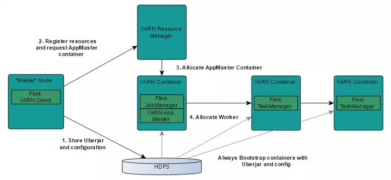

YARN客户端需要访问Hadoop配置来连接YARN资源管理器和HDFS。使用下面的策略来确定Hadoop的配置：

YARN_CONF_DIR，HADOOP_CONF_DIR，HADOOP_CONF_PATH.其中一个变量被设置，就能读取配置；

如果上面的策略失败（在正确的Yarn设置中不应该出来这种情况），客户端使用HADOOP_HOME环境变量。如果设置了，那么客户端就会尝试访问$HADOOP_HOME/etc/hadoop


step1: 当启动一个新的Flink YARN session时，客户端首先检查资源（container和memory）是否可用。然后，上传一个包含Flink和配置的jar包到HDFS上；

step2：客户端请求YARN container启动ApplicationMaster；

step3：由于客户端将配置和jar文件注册到容器，在特定机器上运行的YARN的NodeManager将负责准备container（例如下载文件）。一旦完成，ApplicationMaster就被启动了。

step4：JobManager和ApplicationMaster运行在同一个container上。一旦他们被成功启动，AM就知道JobManager的地址（AM它自己所在的机器）。它就会为TaskManager生成一个新的Flink配置文件（他们就可以连接到JobManager）。这个配置文件也被上传到HDFS上。此外，AM容器也提供了Flink的web服务接口。YARN所分配的所有端口都是临时端口，这允许用户并行执行多个Flink  session；

最后，AM开始为Flink的任务TaskManager分配container，它将从HDFS加载jar文件和修改的配置文件。一旦这些步骤完成，Flink就准备好接口Job的提交了。

## 任务处理过程

当Flink系统启动时，首先启动JobManager和一至多个TaskManager。

JobManager负责协调Flink系统，TaskManager则是执行并行程序的worker。

当系统以本地形式启动时，一个JobManager和一个TaskManager会启动在同一个JVM中。

当一个程序被提交后，系统会创建一个Client来进行预处理，将程序转变成一个并行数据流的形式，交给JobManager和TaskManager执行。

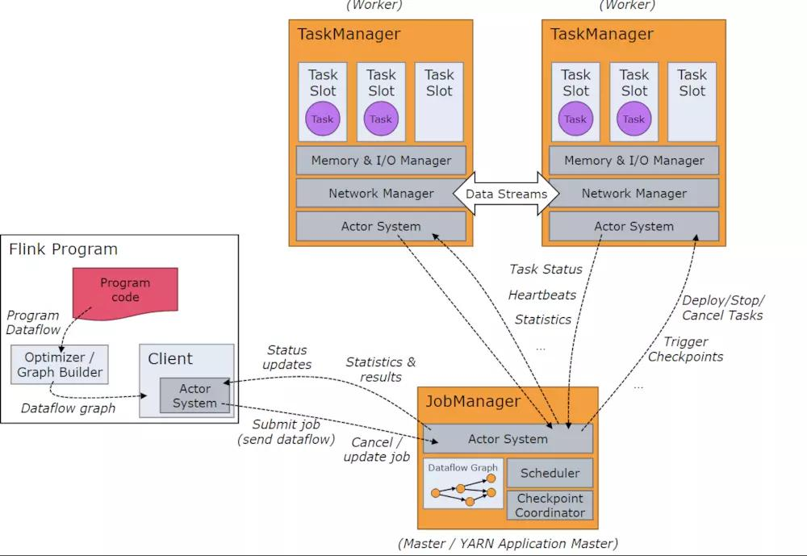

## 常见问题

- Retrying connect to server

Flink on yarn 依赖hadoop集群，在没有启动hadoop之前，直接执行Flink启动命令;

结果就是flink连不上ResourceManager，脚本一直卡在着进行重试。

启动好 hadoop 环境后再启动Flink。

```
2018-05-19 14:36:08,062 INFO  org.apache.hadoop.yarn.client.RMProxy - Connecting to ResourceManager at /0.0.0.0:8032  
2018-05-19 14:36:09,231 INFO  org.apache.hadoop.ipc.Client - Retrying connect to server: 0.0.0.0/0.0.0.0:8032. Already tried 0 time(s); retry policy is RetryUpToMaximumCountWithFixedSleep(maxRetries=10, sleepTime=1000 MILLISECONDS)  
2018-05-19 14:36:10,234 INFO  org.apache.hadoop.ipc.Client - Retrying connect to server: 0.0.0.0/0.0.0.0:8032. Already tried 1 time(s); retry policy is RetryUpToMaximumCountWithFixedSleep(maxRetries=10, sleepTime=1000 MILLISECONDS)  
2018-05-19 14:36:11,235 INFO  org.apache.hadoop.ipc.Client - Retrying connect to server: 0.0.0.0/0.0.0.0:8032. Already tried 2 time(s); retry policy is RetryUpToMaximumCountWithFixedSleep(maxRetries=10, sleepTime=1000 MILLISECONDS)  
2018-05-19 14:36:12,238 INFO  org.apache.hadoop.ipc.Client - Retrying connect to server: 0.0.0.0/0.0.0.0:8032. Already tried 3 time(s); retry policy is RetryUpToMaximumCountWithFixedSleep(maxRetries=10, sleepTime=1000 MILLISECONDS)  
2018-05-19 14:36:13,240 INFO  org.apache.hadoop.ipc.Client - Retrying connect to server: 0.0.0.0/0.0.0.0:8032. Already tried 4 time(s); retry policy is RetryUpToMaximumCountWithFixedSleep(maxRetries=10, sleepTime=1000 MILLISECONDS)  
2018-05-19 14:36:14,247 INFO  org.apache.hadoop.ipc.Client - Retrying connect to server: 0.0.0.0/0.0.0.0:8032. Already tried 5 time(s); retry policy is RetryUpToMaximumCountWithFixedSleep(maxRetries=10, sleepTime=1000 MILLISECONDS)  
```

- Unable to get ClusterClient status from Application Client

```
2018-05-19 15:30:10,456 WARN  akka.remote.ReliableDeliverySupervisor                        - Association with remote system [akka.tcp://flink@hadoop100:55053] has failed, address is now gated for [5000] ms. Reason: [Disassociated] 
2018-05-19 15:30:21,680 WARN  org.apache.flink.yarn.cli.FlinkYarnSessionCli                 - Could not retrieve the current cluster status. Skipping current retrieval attempt ...
java.lang.RuntimeException: Unable to get ClusterClient status from Application Client
        at org.apache.flink.yarn.YarnClusterClient.getClusterStatus(YarnClusterClient.java:253)
        at org.apache.flink.yarn.cli.FlinkYarnSessionCli.runInteractiveCli(FlinkYarnSessionCli.java:443)
        at org.apache.flink.yarn.cli.FlinkYarnSessionCli.run(FlinkYarnSessionCli.java:720)
        at org.apache.flink.yarn.cli.FlinkYarnSessionCli$1.call(FlinkYarnSessionCli.java:514)
        at org.apache.flink.yarn.cli.FlinkYarnSessionCli$1.call(FlinkYarnSessionCli.java:511)
        at java.security.AccessController.doPrivileged(Native Method)
        at javax.security.auth.Subject.doAs(Subject.java:422)
        at org.apache.hadoop.security.UserGroupInformation.doAs(UserGroupInformation.java:1698)
        at org.apache.flink.runtime.security.HadoopSecurityContext.runSecured(HadoopSecurityContext.java:41)
        at org.apache.flink.yarn.cli.FlinkYarnSessionCli.main(FlinkYarnSessionCli.java:511)
Caused by: org.apache.flink.util.FlinkException: Could not connect to the leading JobManager. Please check that the JobManager is running.
        at org.apache.flink.client.program.ClusterClient.getJobManagerGateway(ClusterClient.java:862)
        at org.apache.flink.yarn.YarnClusterClient.getClusterStatus(YarnClusterClient.java:248)
        ... 9 more
Caused by: org.apache.flink.runtime.leaderretrieval.LeaderRetrievalException: Could not retrieve the leader gateway.
        at org.apache.flink.runtime.util.LeaderRetrievalUtils.retrieveLeaderGateway(LeaderRetrievalUtils.java:79)
        at org.apache.flink.client.program.ClusterClient.getJobManagerGateway(ClusterClient.java:857)
        ... 10 more
Caused by: java.util.concurrent.TimeoutException: Futures timed out after [10000 milliseconds]
        at scala.concurrent.impl.Promise$DefaultPromise.ready(Promise.scala:223)
        at scala.concurrent.impl.Promise$DefaultPromise.result(Promise.scala:227)
        at scala.concurrent.Await$$anonfun$result$1.apply(package.scala:190)
        at scala.concurrent.BlockContext$DefaultBlockContext$.blockOn(BlockContext.scala:53)
        at scala.concurrent.Await$.result(package.scala:190)
        at scala.concurrent.Await.result(package.scala)
        at org.apache.flink.runtime.util.LeaderRetrievalUtils.retrieveLeaderGateway(LeaderRetrievalUtils.java:77)
        ... 11 more
2018-05-19 15:30:21,691 WARN  org.apache.flink.yarn.YarnClusterClient                       - YARN reported application state FAILED
2018-05-19 15:30:21,692 WARN  org.apache.flink.yarn.YarnClusterClient                       - Diagnostics: Application application_1521277661809_0006 failed 1 times due to AM Container for appattempt_1521277661809_0006_000001 exited with  exitCode: -103
For more detailed output, check application tracking page:http://hadoop100:8088/cluster/app/application_1521277661809_0006Then, click on links to logs of each attempt.
Diagnostics: Container [pid=6386,containerID=container_1521277661809_0006_01_000001] is running beyond virtual memory limits. Current usage: 250.5 MB of 1 GB physical memory used; 2.2 GB of 2.1 GB virtual memory used. Killing container.
Dump of the process-tree for container_1521277661809_0006_01_000001 :
        |- PID PPID PGRPID SESSID CMD_NAME USER_MODE_TIME(MILLIS) SYSTEM_TIME(MILLIS) VMEM_USAGE(BYTES) RSSMEM_USAGE(PAGES) FULL_CMD_LINE
        |- 6386 6384 6386 6386 (bash) 0 0 108625920 331 /bin/bash -c /usr/local/jdk/bin/java -Xmx424m  -Dlog.file=/usr/local/hadoop/logs/userlogs/application_1521277661809_0006/container_1521277661809_0006_01_000001/jobmanager.log -Dlog4j.configuration=file:log4j.properties org.apache.flink.yarn.YarnApplicationMasterRunner  1> /usr/local/hadoop/logs/userlogs/application_1521277661809_0006/container_1521277661809_0006_01_000001/jobmanager.out 2> /usr/local/hadoop/logs/userlogs/application_1521277661809_0006/container_1521277661809_0006_01_000001/jobmanager.err 
        |- 6401 6386 6386 6386 (java) 388 72 2287009792 63800 /usr/local/jdk/bin/java -Xmx424m -Dlog.file=/usr/local/hadoop/logs/userlogs/application_1521277661809_0006/container_1521277661809_0006_01_000001/jobmanager.log -Dlog4j.configuration=file:log4j.properties org.apache.flink.yarn.YarnApplicationMasterRunner 
Container killed on request. Exit code is 143
Container exited with a non-zero exit code 143
Failing this attempt. Failing the application.
The YARN cluster has failed
2018-05-19 15:30:21,693 INFO  org.apache.flink.yarn.YarnClusterClient                       - Sending shutdown request to the Application Master
2018-05-19 15:30:21,695 WARN  org.apache.flink.yarn.YarnClusterClient                       - YARN reported application state FAILED
2018-05-19 15:30:21,695 WARN  org.apache.flink.yarn.YarnClusterClient                       - Diagnostics: Application application_1521277661809_0006 failed 1 times due to AM Container for appattempt_1521277661809_0006_000001 exited with  exitCode: -103
For more detailed output, check application tracking page:http://hadoop100:8088/cluster/app/application_1521277661809_0006Then, click on links to logs of each attempt.
Diagnostics: Container [pid=6386,containerID=container_1521277661809_0006_01_000001] is running beyond virtual memory limits. Current usage: 250.5 MB of 1 GB physical memory used; 2.2 GB of 2.1 GB virtual memory used. Killing container.
Dump of the process-tree for container_1521277661809_0006_01_000001 :
        |- PID PPID PGRPID SESSID CMD_NAME USER_MODE_TIME(MILLIS) SYSTEM_TIME(MILLIS) VMEM_USAGE(BYTES) RSSMEM_USAGE(PAGES) FULL_CMD_LINE
        |- 6386 6384 6386 6386 (bash) 0 0 108625920 331 /bin/bash -c /usr/local/jdk/bin/java -Xmx424m  -Dlog.file=/usr/local/hadoop/logs/userlogs/application_1521277661809_0006/container_1521277661809_0006_01_000001/jobmanager.log -Dlog4j.configuration=file:log4j.properties org.apache.flink.yarn.YarnApplicationMasterRunner  1> /usr/local/hadoop/logs/userlogs/application_1521277661809_0006/container_1521277661809_0006_01_000001/jobmanager.out 2> /usr/local/hadoop/logs/userlogs/application_1521277661809_0006/container_1521277661809_0006_01_000001/jobmanager.err 
        |- 6401 6386 6386 6386 (java) 388 72 2287009792 63800 /usr/local/jdk/bin/java -Xmx424m -Dlog.file=/usr/local/hadoop/logs/userlogs/application_1521277661809_0006/container_1521277661809_0006_01_000001/jobmanager.log -Dlog4j.configuration=file:log4j.properties org.apache.flink.yarn.YarnApplicationMasterRunner 
Container killed on request. Exit code is 143
Container exited with a non-zero exit code 143
Failing this attempt. Failing the application.
2018-05-19 15:30:21,697 INFO  org.apache.flink.yarn.ApplicationClient                       - Sending StopCluster request to JobManager.
2018-05-19 15:30:21,726 WARN  akka.remote.transport.netty.NettyTransport                    - Remote connection to [null] failed with java.net.ConnectException: Connection refused: hadoop100/192.168.99.100:55053
2018-05-19 15:30:21,733 WARN  akka.remote.ReliableDeliverySupervisor                        - Association with remote system [akka.tcp://flink@hadoop100:55053] has failed, address is now gated for [5000] ms. Reason: [Association failed with [akka.tcp://flink@hadoop100:55053]] Caused by: [Connection refused: hadoop100/192.168.99.100:55053]
2018-05-19 15:30:31,707 WARN  org.apache.flink.yarn.YarnClusterClient                       - Error while stopping YARN cluster.
java.util.concurrent.TimeoutException: Futures timed out after [10000 milliseconds]
        at scala.concurrent.impl.Promise$DefaultPromise.ready(Promise.scala:223)
        at scala.concurrent.impl.Promise$DefaultPromise.ready(Promise.scala:157)
        at scala.concurrent.Await$$anonfun$ready$1.apply(package.scala:169)
        at scala.concurrent.Await$$anonfun$ready$1.apply(package.scala:169)
        at scala.concurrent.BlockContext$DefaultBlockContext$.blockOn(BlockContext.scala:53)
        at scala.concurrent.Await$.ready(package.scala:169)
        at scala.concurrent.Await.ready(package.scala)
        at org.apache.flink.yarn.YarnClusterClient.shutdownCluster(YarnClusterClient.java:377)
        at org.apache.flink.yarn.YarnClusterClient.finalizeCluster(YarnClusterClient.java:347)
        at org.apache.flink.client.program.ClusterClient.shutdown(ClusterClient.java:263)
        at org.apache.flink.yarn.cli.FlinkYarnSessionCli.runInteractiveCli(FlinkYarnSessionCli.java:466)
        at org.apache.flink.yarn.cli.FlinkYarnSessionCli.run(FlinkYarnSessionCli.java:720)
        at org.apache.flink.yarn.cli.FlinkYarnSessionCli$1.call(FlinkYarnSessionCli.java:514)
        at org.apache.flink.yarn.cli.FlinkYarnSessionCli$1.call(FlinkYarnSessionCli.java:511)
        at java.security.AccessController.doPrivileged(Native Method)
        at javax.security.auth.Subject.doAs(Subject.java:422)
        at org.apache.hadoop.security.UserGroupInformation.doAs(UserGroupInformation.java:1698)
        at org.apache.flink.runtime.security.HadoopSecurityContext.runSecured(HadoopSecurityContext.java:41)
        at org.apache.flink.yarn.cli.FlinkYarnSessionCli.main(FlinkYarnSessionCli.java:511)
2018-05-19 15:30:31,711 INFO  org.apache.flink.yarn.YarnClusterClient                       - Deleted Yarn properties file at /tmp/.yarn-properties-root
2018-05-19 15:30:31,881 INFO  org.apache.flink.yarn.YarnClusterClient                       - Application application_1521277661809_0006 finished with state FAILED and final state FAILED at 1521294610146
2018-05-19 15:30:31,882 WARN  org.apache.flink.yarn.YarnClusterClient                       - Application failed. Diagnostics Application application_1521277661809_0006 failed 1 times due to AM Container for appattempt_1521277661809_0006_000001 exited with  exitCode: -103
For more detailed output, check application tracking page:http://hadoop100:8088/cluster/app/application_1521277661809_0006Then, click on links to logs of each attempt.
Diagnostics: Container [pid=6386,containerID=container_1521277661809_0006_01_000001] is running beyond virtual memory limits. Current usage: 250.5 MB of 1 GB physical memory used; 2.2 GB of 2.1 GB virtual memory used. Killing container.
Dump of the process-tree for container_1521277661809_0006_01_000001 :
        |- PID PPID PGRPID SESSID CMD_NAME USER_MODE_TIME(MILLIS) SYSTEM_TIME(MILLIS) VMEM_USAGE(BYTES) RSSMEM_USAGE(PAGES) FULL_CMD_LINE
        |- 6386 6384 6386 6386 (bash) 0 0 108625920 331 /bin/bash -c /usr/local/jdk/bin/java -Xmx424m  -Dlog.file=/usr/local/hadoop/logs/userlogs/application_1521277661809_0006/container_1521277661809_0006_01_000001/jobmanager.log -Dlog4j.configuration=file:log4j.properties org.apache.flink.yarn.YarnApplicationMasterRunner  1> /usr/local/hadoop/logs/userlogs/application_1521277661809_0006/container_1521277661809_0006_01_000001/jobmanager.out 2> /usr/local/hadoop/logs/userlogs/application_1521277661809_0006/container_1521277661809_0006_01_000001/jobmanager.err 
        |- 6401 6386 6386 6386 (java) 388 72 2287009792 63800 /usr/local/jdk/bin/java -Xmx424m -Dlog.file=/usr/local/hadoop/logs/userlogs/application_1521277661809_0006/container_1521277661809_0006_01_000001/jobmanager.log -Dlog4j.configuration=file:log4j.properties org.apache.flink.yarn.YarnApplicationMasterRunner 
Container killed on request. Exit code is 143
Container exited with a non-zero exit code 143
Failing this attempt. Failing the application.
2018-05-19 15:30:31,884 WARN  org.apache.flink.yarn.YarnClusterClient                       - If log aggregation is activated in the Hadoop cluster, we recommend to retrieve the full application log using this command:
        yarn logs -applicationId application_1521277661809_0006
(It sometimes takes a few seconds until the logs are aggregated)
2018-05-19 15:30:31,885 INFO  org.apache.flink.yarn.YarnClusterClient                       - YARN Client is shutting down
2018-05-19 15:30:31,909 INFO  org.apache.flink.yarn.ApplicationClient                       - Stopped Application client.
2018-05-19 15:30:31,911 INFO  org.apache.flink.yarn.ApplicationClient                       - Disconnect from JobManager Actor[akka.tcp://flink@hadoop100:55053/user/jobmanager#119148826].
2018-05-19 15:30:31,916 INFO  akka.remote.RemoteActorRefProvider$RemotingTerminator         - Shutting down remote daemon.
2018-05-19 15:30:31,926 WARN  akka.remote.transport.netty.NettyTransport                    - Remote connection to [null] failed with java.net.ConnectException: Connection refused: hadoop100/192.168.99.100:55053
2018-05-19 15:30:31,935 WARN  akka.remote.ReliableDeliverySupervisor                        - Association with remote system [akka.tcp://flink@hadoop100:55053] has failed, address is now gated for [5000] ms. Reason: [Association failed with [akka.tcp://flink@hadoop100:55053]] Caused by: [Connection refused: hadoop100/192.168.99.100:55053]
2018-05-19 15:30:31,935 INFO  akka.remote.RemoteActorRefProvider$RemotingTerminator         - Remote daemon shut down; proceeding with flushing remote transports.
2018-05-19 15:30:34,979 INFO  org.apache.flink.yarn.cli.FlinkYarnSessionCli    
```

这种错误一般是Hadoop集群资源（内存、磁盘、虚拟内存等等）不足造成的。 

并且多数情况是由于分配的虚拟内存超出限制，两种方法解决： 

（1）将 Hadoop 的检查虚拟内存关闭掉。如下：

```
vim yarn-site.xml

# 添加如下内容：
<property>    
    <name>yarn.nodemanager.vmem-check-enabled</name>    
    <value>false</value>    
</property>  
```

（2）把分配的内存调小，尝试改为 800 即可正常启动。这种方法不是很长久，运行一段时间，最终container还是会被kill掉。

```
AM Container for appattempt_1526107053244_0016_000001 exited with exitCode: -103
For more detailed output, check application tracking page:http://xxx:8099/cluster/app/application_1526107053244_0016Then, click on links to logs of each attempt.
Diagnostics: Container [pid=28987,containerID=container_1526107053244_0016_01_000001] is running beyond virtual memory limits. Current usage: 366.0 MB of 1 GB physical memory used; 2.1 GB of 2.1 GB virtual memory used. Killing container.
Dump of the process-tree for container_1526107053244_0016_01_000001 :
|- PID PPID PGRPID SESSID CMD_NAME USER_MODE_TIME(MILLIS) SYSTEM_TIME(MILLIS) VMEM_USAGE(BYTES) RSSMEM_USAGE(PAGES) FULL_CMD_LINE
|- 28987 28985 28987 28987 (bash) 0 0 108650496 299 /bin/bash -c /opt/jdk/jdk1.8.0_25/bin/java -Xmx200m -Dlog.file=/opt/xxx/hadoop/hadoop-2.7.3/logs/userlogs/application_1526107053244_0016/container_1526107053244_0016_01_000001/jobmanager.log -Dlogback.configurationFile=file:logback.xml -Dlog4j.configuration=file:log4j.properties org.apache.flink.yarn.YarnApplicationMasterRunner 1> /opt/xxx/hadoop/hadoop-2.7.3/logs/userlogs/application_1526107053244_0016/container_1526107053244_0016_01_000001/jobmanager.out 2> /opt/bl07637/hadoop/hadoop-2.7.3/logs/userlogs/application_1526107053244_0016/container_1526107053244_0016_01_000001/jobmanager.err
|- 29009 28987 28987 28987 (java) 5094 780 2186571776 93395 /opt/jdk/jdk1.8.0_25/bin/java -Xmx200m -Dlog.file=/opt/xxx/hadoop/hadoop-2.7.3/logs/userlogs/application_1526107053244_0016/container_1526107053244_0016_01_000001/jobmanager.log -Dlogback.configurationFile=file:logback.xml -Dlog4j.configuration=file:log4j.properties org.apache.flink.yarn.YarnApplicationMasterRunner
Container killed on request. Exit code is 143
Container exited with a non-zero exit code 143
Failing this attempt
```

更多内容查看：[https://blog.csdn.net/weitry/article/details/80375446](https://blog.csdn.net/weitry/article/details/80375446)
