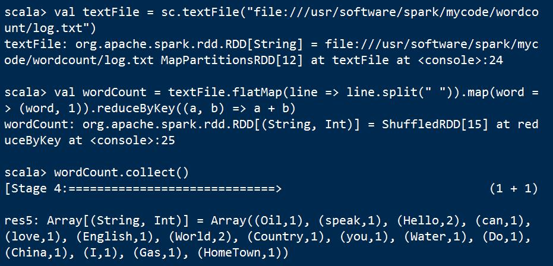

## 2 Spark RDD及编程接口

### 2.1 Spark程序 "Hello World"

```
## 启动Spark
[root@master spark-2.3.2-bin-hadoop2.7]# bin/spark-shell spark://master:7077
## 计算出现字符串"Hello World"的行数
scala> val textFile = sc.textFile("hdfs:///root/log/log.txt")
scala> val filterRDD = textFile.filter(_.contains("Hello World"))
scala> filterRDD.cache()
scala> filterRDD.count()
```

- 弹性分布式数据集RDD(Resilient Distributed DataSets)

- 创建操作(create operation)

> RDD的初始创建均由SparkContext来负责，将**内存中的集合或者外部文件系统**作为输入源。

- 转换操作(transformation operation)

> 将一个RDD通过一定的操作变换成另一个RDD。

- 控制操作(control operation)

> 对RDD进行持久化，可以将RDD保存在磁盘中或者内存中，以便后续重复使用。

- 行动操作(action operation)

> Spark是惰性计算(lazy computing)的，只有执行到行动操作，才会执行真正的操作。

> Spark中的行动操作分为两类，一类的操作结果为Scala集合或标量；另一类就将RDD保存在外部文件或者数据库系统中。


### 2.2 Spark RDD

Spark RDD的生成有两种路径：

- 内存集合或者外部文件系统；
- 其他RDD的转换操作。

Spark RDD的接口如下：

| 接口 | 描述 |
| :------: | :------: |
| partition | 分区，一个RDD有一个或者多个分区 |
| preferredLocations(p) | 对于分区p而言，返回数据本地化计算的节点 |
| dependencies() | RDD的依赖关系 |
| compute(p, context) | 对于分区p而言，进行迭代计算 |
| partitioner() | RDD的分区函数 |

#### 2.2.1 RDD分区(partitions)

```
## 指定分区数为2
scala> val rdd = sc.parallelize(1 to 100, 2)
scala> rdd.partitions.size
## 不指定，采用默认分区数，系统默认的数值是该程序分配到的资源的CPU核的个数
scala> val rdd = sc.parallelize(1 to 100)
scala> rdd.partitions.siz
```

#### 2.2.2 RDD优先位置(preferredLocations)

> RDD优先位置与Spark中的调度有关，返回的为该RDD每个partition所存储的位置。

> Spark进行任务调度的时候，尽可能的将任务分配到数据块所存储的位置，即"移动数据不如移动计算"。

```
scala> val textFile = sc.textFile("hdfs://master:9000/root/log/log.txt") # 生成MapPartitionRDD
scala> val hadoopRDD = textFile.dependencies(0).rdd # 通过依赖关系找到原始的HadoopRDD
scala> hadoopRDD.partitions.size # HadoopRDD的分区数为2个
scala> hadoopRDD.preferredLocations(hadoopRDD.partitions(0)) # 查看第一个分区其preferredLocations返回的3台机器
```


#### 2.2.3 RDD依赖关系(dependencies)

> 每一个转换操作就会生成一个新的RDD，所以RDD之间就会形成流水线一样的前后依赖关系。在Spark中存在两种类型的依赖：

- 窄依赖(Narrow Dependencies)

每一个父RDD的分区最多被子RDD的一个分区所使用；

- 宽依赖(Wide Dependencies)

多个子RDD的分区会依赖于同一个父RDD的分区；


明确区分两种依赖主要考虑到：

1. 窄依赖可以在单节点上如流水线一样执行，可以计算所有父RDD的分区，而宽依赖则需要取得父RDD上所有分区的数据进行计算，将会执行类似于MapReduce的Shuffle操作；
2. 窄依赖错误回滚容易，而宽依赖由于单节点的失败将导致其父RDD的多个分区重新计算，故回滚代价较大。

#### 2.2.4 RDD分区计算(compute)

compute函数只返回相应分区数据的迭代器，仅有最终实例化才会显示分区的最终计算结果。

#### 2.2.5 RDD分区函数(partitioner)

在Spark中实现了两种类型的分区函数：

- HashPatitioner(哈希分区)
- RangePatitioner(区域分区)

partitioner属性仅存在于(K, V)类型的RDD中，非(K, V)类型的partitioner属性为None。


### 文件IO
```
scala> val textFile = sc.textFile("hdfs://master:9000/root/log/log.txt")
scala> val textFile = sc.textFile("file:///root/log.txt")
# 需要注意的是，从本地文件系统读取数据时，因为不知道是哪个节点执行任务，故需要每个节点均复制一份log.txt文件
scala> textFile.first()
## 将RDD写回文件系统
 textFile.saveAsTextFile("hdfs://master:9000/root/log/writeback")
scala> textFile.saveAsTextFile("file:///root/writeback")
```

### 词频统计




### IntelliJ IDEA + Maven + Scala


```
import org.apache.spark.{SparkConf, SparkContext}

object WordCount {
  def main(args: Array[String]): Unit = {
    val inputFile = "hdfs://master:9000/root/log/log.txt"
    val conf = new SparkConf().setAppName("WordCount").setMaster("spark://master:7077")
    val sc = new SparkContext(conf)
    val textFile = sc.textFile(inputFile)
    val wordCount = textFile.flatMap(line => line.split(" ")).map(word => (word, 1)).reduceByKey((a, b) => a + b)
    wordCount.collect().foreach(println)
  }
}
```

```
<?xml version="1.0" encoding="UTF-8"?>
<project xmlns="http://maven.apache.org/POM/4.0.0"
         xmlns:xsi="http://www.w3.org/2001/XMLSchema-instance"
         xsi:schemaLocation="http://maven.apache.org/POM/4.0.0 http://maven.apache.org/xsd/maven-4.0.0.xsd">
    <modelVersion>4.0.0</modelVersion>

    <groupId>com.ruanshubin</groupId>
    <artifactId>wordcount</artifactId>
    <version>1.0-SNAPSHOT</version>
    
    <properties>
        <spark.version>2.3.2</spark.version>
        <scala.version>2.11</scala.version>
    </properties>

    <dependencies>
        <dependency>
            <groupId>org.apache.spark</groupId>
            <artifactId>spark-core_${scala.version}</artifactId>
            <version>${spark.version}</version>
        </dependency>
        <dependency>
            <groupId>org.apache.spark</groupId>
            <artifactId>spark-streaming_${scala.version}</artifactId>
            <version>${spark.version}</version>
        </dependency>
        <dependency>
            <groupId>org.apache.spark</groupId>
            <artifactId>spark-sql_${scala.version}</artifactId>
            <version>${spark.version}</version>
        </dependency>
        <dependency>
            <groupId>org.apache.spark</groupId>
            <artifactId>spark-hive_${scala.version}</artifactId>
            <version>${spark.version}</version>
        </dependency>
        <dependency>
            <groupId>org.apache.spark</groupId>
            <artifactId>spark-mllib_${scala.version}</artifactId>
            <version>${spark.version}</version>
        </dependency>

    </dependencies>

    <build>
        <plugins>

            <plugin>
                <groupId>org.scala-tools</groupId>
                <artifactId>maven-scala-plugin</artifactId>
                <version>2.15.2</version>
                <executions>
                    <execution>
                        <goals>
                            <goal>compile</goal>
                            <goal>testCompile</goal>
                        </goals>
                    </execution>
                </executions>
            </plugin>

            <plugin>
                <artifactId>maven-compiler-plugin</artifactId>
                <version>3.6.0</version>
                <configuration>
                    <source>1.8</source>
                    <target>1.8</target>
                </configuration>
            </plugin>

            <plugin>
                <groupId>org.apache.maven.plugins</groupId>
                <artifactId>maven-surefire-plugin</artifactId>
                <version>2.19</version>
                <configuration>
                    <skip>true</skip>
                </configuration>
            </plugin>

        </plugins>
    </build>
    
</project>
```


### RDD编程

```
scala> val lines = sc.textFile("file:///usr/software/spark/mycode/wordcount/log.txt")
scala> val lines = sc.textFile("hdfs://master:9000/root/log/log.txt")
// 查询文章中包含某单词的行数
scala> lines.filter(line => line.contains("Oil")).count()
scala> lines.filter(_.contains("World")).count()
// 找出文本文件中单行文本所包含的单词数量的最大值
scala> lines.map(line => line.split(" ").size).reduce((a,b) => if (a>b) a else b)
scala> lines.map(_.split(" ").size).reduce((a,b) => if (a>b) a else b)
// 创建键值对
scala> val pairRDD = lines.flatMap(line => line.split(" ")).map(word => (word, 1))
// reduceByKey(func)
scala> pairRDD.reduceByKey((a,b) => a+b).collect().foreach(println)
// keys
scala> pairRDD.keys.collect().foreach(println)
// values
scala> pairRDD.values.collect().foreach(println)
// mapValues(func)
scala> pairRDD.mapValues(x => x+1).collect().foreach(println)
// sortByKey()
scala> pairRDD.sortByKey().collect().foreach(println)
// join
scala> val pairRDD1 = sc.parallelize(Array(("Spark", 1), ("Spark", 2), ("Hadoop", 3)))
scala> val pairRDD2 = sc.parallelize(Array(("Spark", "fast")))
scala> pairRDD1.join(pairRDD2).collect().foreach(println)
// 统计每天书籍的平均数
scala> val rdd = sc.parallelize(Array(("spark",2),("hadoop",6),("hadoop",4),("spark",6)))
scala> rdd.mapValues(x => (x,1)).reduceByKey((x,y) => (x._1+y._1,x._2 + y._2)).mapValues(x => (x._1 / x._2)).collect()

```

```
val jdbcDF = spark.read.format("jdbc").option("url","jdbc:mysql://10.
194.238.6:3306/spark").option("driver", "com.mysql.jdbc.Driver").option("dbt
able", "student").option("user", "root").option("password", "hiatmp").load()

spark-shell \
--master spark://master:7077 \
--jars /usr/software/spark/mycode/jars/mysql-connector-java-5.1.38.jar \
--driver-class-path /usr/software/spark/mycode/jars/mysql-connector-java-5.1.38.jar

spark-submit \
--class WordCount \
./wordcount.jar \
--jars /usr/software/spark/mycode/jars/mysql-connector-java-5.1.38.jar \
--driver-class-path /usr/software/spark/mycode/jars/mysql-connector-java-5.1.38.jar

spark-submit \
--master spark://master:7077 \
--class WordCount \
--jars /usr/software/spark/mycode/jars/mysql-connector-java-5.1.38.jar \
--driver-class-path /usr/software/spark/mycode/jars/mysql-connector-java-5.1.38.jar ./wordcount.jar
```

## 数据结构

- ArrayList --> Dataset<Row>

```
SparkSession sparkSession = new ReadParquet().getSparkSession("dataSetSim");
List<Prti> prtiList = new ArrayList<>();
prtiList.add(new Prti(1546956795000L, "f562_car.0", "101", "1", "2", 5.0, "car", -1.0, -1));
prtiList.add(new Prti(1546956795000L, "f650_bus.0", "104", "1", "2", 5.0, "car", -1.0, -1));
prtiList.add(new Prti(1546956795000L, "f562_car.0", "101", "1", "2", 5.0, "car", -1.0, -1));
prtiList.add(new Prti(1546956795000L, "f562_car.0", "101", "1", "2", 5.0, "car", -1.0, -1));
prtiList.add(new Prti(1546956795000L, "f562_car.0", "101", "1", "2", 5.0, "car", -1.0, -1));
Dataset<Row> datasetRow = sparkSession.createDataFrame(prtiList, Prti.class);
datasetRow.show();
```

如果需要将Row转换为指定的类型：

```
Encoder<Prti> prtiEncoder = Encoders.bean(Prti.class);
Dataset<Prti> datasetPrti = datasetRow.as(prtiEncoder);
datasetPrti.show();
```

执行map操作时，需要指定返回类型的encoder，可以基于Encoders工具类进行创建。

注意的是：常规类型如String等，直接调用ncoders.STRING()即可。

```
Dataset<String> plateNo = datasetRow.map(new MapFunction<Row, String>() {
	@Override
	public String call(Row row) throws Exception {
		return row.getAs("plateNo");
	}
}, Encoders.STRING());
plateNo.show();
```

```
// 也可以基于列编号来读取，get[Type]为当前列的数据类型
row.getString(5)
// get方法也是可以的，但是需要进行类型的强制转化，因为默认返回的是object
(String) row.get(5)
```
