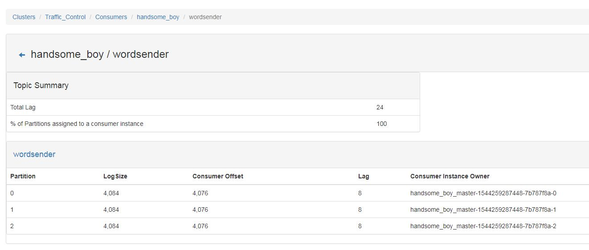

Kafka作为优秀的日志采集系统，可以作为Spark Streaming的高级数据源，本文主要介绍如何使用Spark Streaming实时处理Kafka传递过来的数据流。

## 1 系统软件

本文实验基于的各软件版本如下：

- Java 1.8.0_191
- Scala 2.11
- hadoop-3.0.3
- zookeeper-3.4.10
- Spark 2.3.2
- kafka_2.12-2.0.1
- kafka-manager-1.3.3.17 

## 2 具体步骤

### 2.1 启动Kafka集群

启动Kafka集群之前首先启动Zookeeper集群：

- 在安装有Zookeeper的机器上执行下述命令：

```
cd /usr/software/zookeeper/zookeeper-3.4.10/bin/
./zkServer.sh start
```

- 另外打开一个终端，输入以下命令启动Kafka集群：

```
cd /usr/software/kafka/kafka_2.12-2.0.1/bin
./kafka-server-start.sh ../config/server.properties
```

- 测试Kafka集群是否可以正常使用

```
cd /usr/software/kafka/kafka_2.12-2.0.1
./bin/kafka-topics.sh --create --zookeeper slave1:2181,slave2:2181,slave3:2181 --replication-factor 3 --partitions 3 --topic wordsender
//这个topic叫wordsender，2181是zookeeper默认的端口号，partition是topic里面的分区数，replication-factor是备份的数量
//可以用list列出所有创建的topics,来查看上面创建的topic是否存在
./bin/kafka-topics.sh --list --zookeeper slave1:2181,slave2:2181,slave3:2181
```

### 2.2 Kafka脚本测试数据的生成和消费

下面使用Kafka的producer脚本生成一些数据：

```
cd /usr/software/kafka/kafka_2.12-2.0.1/bin
./kafka-console-producer.sh --broker-list master:9092 --topic wordsender

执行上述命令后，即进入producer的console界面，输入一些数据：
Hello World
Hello Spark
Hello Kafka
```

另外打开一个终端使用Kafka的consumer脚本消费上述producer脚本生成的数据：

```
cd /usr/software/kafka/kafka_2.12-2.0.1/bin/
./kafka-console-consumer.sh --bootstrap-server master:9092  --topic wordsender --from-beginning

```

> 需要注意的是，在旧版本的kafka-console-consumer.sh中，是通过--zookeeper来消费数据的，而新版本的kafka则删除了该方法，统一使用--bootstrap-server，后面跟的是broker-list参数。


### 2.3 编写相应程序测试Kafka的数据生产及消费

本实验基于Maven作为项目构建工具，选择的IDE为IntelliJ IDEA 2018.1 ，采用的编程语言为Scala。

创建Maven工程后，项目处右键Add Frameworks Support:


首先，我们来编写producer端的代码：

- pom.xml

```
<?xml version="1.0" encoding="UTF-8"?>
<project xmlns="http://maven.apache.org/POM/4.0.0"
         xmlns:xsi="http://www.w3.org/2001/XMLSchema-instance"
         xsi:schemaLocation="http://maven.apache.org/POM/4.0.0 http://maven.apache.org/xsd/maven-4.0.0.xsd">
    <modelVersion>4.0.0</modelVersion>

    <groupId>com.ruanshubin</groupId>
    <artifactId>SparkAndKafka</artifactId>
    <version>1.0-SNAPSHOT</version>

    <properties>
        <spark.version>2.3.2</spark.version>
        <scala.version>2.11</scala.version>
    </properties>

    <dependencies>
        <dependency>
            <groupId>org.apache.spark</groupId>
            <artifactId>spark-core_${scala.version}</artifactId>
            <version>${spark.version}</version>
            <scope>provided</scope>
        </dependency>
        <dependency>
            <groupId>org.apache.spark</groupId>
            <artifactId>spark-streaming_${scala.version}</artifactId>
            <version>${spark.version}</version>
            <scope>provided</scope>
        </dependency>
        <dependency>
            <groupId>org.apache.spark</groupId>
            <artifactId>spark-sql_${scala.version}</artifactId>
            <version>${spark.version}</version>
            <scope>provided</scope>
        </dependency>

        <dependency>
            <groupId>org.apache.spark</groupId>
            <artifactId>spark-streaming-kafka-0-8_2.11</artifactId>
            <version>2.3.2</version>
        </dependency>
    </dependencies>

    <build>
        <sourceDirectory>src/main/scala</sourceDirectory>
        <plugins>
            <plugin>
                <groupId>org.scala-tools</groupId>
                <artifactId>maven-scala-plugin</artifactId>
                <version>2.15.2</version>
                <executions>
                    <execution>
                        <goals>
                            <goal>compile</goal>
                            <goal>testCompile</goal>
                        </goals>
                    </execution>
                </executions>
            </plugin>
            <plugin>
                <groupId>org.apache.maven.plugins</groupId>
                <artifactId>maven-shade-plugin</artifactId>
                <version>3.1.0</version>
                <executions>
                    <execution>
                        <phase>package</phase>
                        <goals>
                            <goal>shade</goal>
                        </goals>
                        <configuration>
                            <createDependencyReducedPom>false</createDependencyReducedPom>
                            <filters>
                                <filter>
                                    <artifact>*:*</artifact>
                                    <excludes>
                                        <exclude>META-INF/*.SF</exclude>
                                        <exclude>META-INF/*.DSA</exclude>
                                        <exclude>META-INF/*.RSA</exclude>
                                    </excludes>
                                </filter>
                            </filters>
                            <transformers>
                                <transformer implementation="org.apache.maven.plugins.shade.resource.ManifestResourceTransformer">
                                    <mainClass>com.ruanshubin.kafka.KafkaWordCount</mainClass>
                                </transformer>
                            </transformers>

                        </configuration>
                    </execution>
                </executions>
            </plugin>
        </plugins>
    </build>  
</project>
```

> 必须使用spark-streaming-kafka-0-8_2.11，不能使用spark-streaming-kafka_2.11，因为该Jar打包的时候会遗漏org.apache.spark.Logging相关包。

> spark-streaming-kafka-0-8_2.11的版本号一定与Scala和Spark版本严格对应，否则会报错。

- KafkaWordProducer.scala

```
package com.ruanshubin.kafka

import java.util

import org.apache.kafka.clients.producer.{KafkaProducer, ProducerConfig, ProducerRecord}

object KafkaWordProducer {
  def main(args: Array[String]): Unit = {
    if(args.length < 4){
      System.err.println("Usage: KafkaWordCountProducer <metadataBrokerList> <topic> +" +
        "<messagePerSec> <wordPerMessage>")
      System.exit(1)
    }

    val Array(brokers, topic, messagesPerSec, wordPerMessage) = args

    val props = new util.HashMap[String, Object]()
    props.put(ProducerConfig.BOOTSTRAP_SERVERS_CONFIG, brokers)
    props.put(ProducerConfig.VALUE_SERIALIZER_CLASS_CONFIG, "org.apache.kafka.common.serialization.StringSerializer")
    props.put(ProducerConfig.KEY_SERIALIZER_CLASS_CONFIG, "org.apache.kafka.common.serialization.StringSerializer")
    val producer = new KafkaProducer[String, String](props)

    while(true){
      (1 to messagesPerSec.toInt).foreach{
        messageNum => val str = (1 to wordPerMessage.toInt).map(x => scala.util.Random.nextInt(10)
          .toString).mkString(" ")
          print(str)
          println()
          val message = new ProducerRecord[String, String](topic, null, str)
          producer.send(message)
      }
      Thread.sleep(1000)
    }
  }
}
```

上述程序的作用就是每秒钟产生messagesPerSec条消息，每条消息包含wordPerMessage个单词(这里用10以内的随机整数代替单词)。

数据产生端producer有了，下面我们编写消费端consumer的代码：

- KafkaWordCount

消费者主要将生产者传递过来的消息执行WordCount操作:

```
package com.ruanshubin.kafka

import org.apache.spark.SparkConf
import org.apache.spark.streaming.kafka.KafkaUtils
import org.apache.spark.streaming.{Minutes, Seconds, StreamingContext}

// spark-streaming-kafka-0-8_2.11的版本号一定要与Scala版本和Spark版本号对应起来
object KafkaWordCount {
  def main(args: Array[String]): Unit = {
    LoggerPro.setStreamingLogLevels()
    val sc = new SparkConf().setAppName("KafkaWordCount").setMaster("local[2]")
    val ssc = new StreamingContext(sc, Seconds(10))

    // 设置检查点
    ssc.checkpoint("/root/spark/checkpoint")
    // Zookeeper服务器地址
    val zkQuorum = "slave1:2181,slave2:2181,slave3:2181"
    // consumer所在的group，可在一个group中设置多个consumer，加快消息消费的速度
    val group = "handsome_boy"
    // topic的名称
    val topics = "wordsender"
    // 每个topic的分区数
    val numThreads = 3
    val topicMap = topics.split(",").map((_,numThreads.toInt)).toMap
    val lineMap = KafkaUtils.createStream(ssc, zkQuorum, group, topicMap)
    val lines = lineMap.map(_._2)
    val words = lines.flatMap(_.split(" "))
    val pair = words.map(x => (x, 1))
    val wordCounts = pair.reduceByKeyAndWindow(_ + _, _ - _,Minutes(2), Seconds(10), 3)
    wordCounts.print
    ssc.start
    ssc.awaitTermination
  }
}

```

LoggerPro的目的是设置日志的打印级别，从而让结果输出的更为清晰，避免被大量的打印信息淹没。

```
package com.ruanshubin.kafka

import org.apache.log4j.{Level, Logger}
import org.apache.spark.internal.Logging

object LoggerPro extends Logging{

  def setStreamingLogLevels(): Unit ={
    val log4jInitialized = Logger.getRootLogger.getAllAppenders.hasMoreElements
    if(!log4jInitialized){
      logInfo("Setting log level to [ERROR] for streaming example." +
        " To override add a custom log4j.properties to the classPath")
      Logger.getRootLogger.setLevel(Level.ERROR)
    }
  }

}
```

**最终的项目结构**如下图所示：


### 2.4 打包、提交集群运行

- Maven打包


- 提交服务器

将项目target目录下生成的可执行Jar包上传到服务器指定目录，这里我上传到/usr/software/spark/mycode/streaming。


- 启动Kafka Manager

为了直观观察到数据流的流转，我们启动Kafka Manager：

```
cd /usr/software/kafka/kafka-manager-1.3.3.17/bin
./kafka-manager -Dhttp.port=9002
```


- 运行


首先启动Producer端：

```
cd /usr/software/spark/spark-2.3.2-bin-hadoop2.7/bin/
./spark-submit --class "com.ruanshubin.kafka.KafkaWordProducer" /usr/software/spark/mycode/streaming/SparkAndKafka-1.0-SNAPSHOT.jar slave1:9092,slave2:9092,slave3:9092 wordsender 3 5

```


新打开一个终端,启动消费者：

```
cd /usr/software/spark/spark-2.3.2-bin-hadoop2.7/bin/
./spark-submit --class "com.ruanshubin.kafka.KafkaWordCount" /usr/software/spark/mycode/streaming/SparkAndKafka-1.0-SNAPSHOT.jar

```


可以看到，Spark Streaming在实时消费Kafka里传过来的数据。

同时，查看Kafka Manger也可以看到数据在实时得产生和消费。

