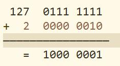
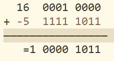

> 计算机底层均是以二进制表示的，数字也不例外，本文旨在探讨一下数字的原码、反码和补码。

## 概念

需要声明的是，本文涉及到的数字及运算均基于**8位bit**下的值。

### 原码

最高位为符号位，0代表正数，1代表负数，非符号位为该数字绝对值的二进制表示。

如：

127的原码为0111 1111
-127的原码为1111 1111

### 反码

正数的反码与原码一致；

负数的反码是对原码按位取反，只是**最高位(符号位)不变**。

如:

127的反码为0111 1111
-127的反码为1000 0000

### 补码

正数的补码与原码一致；

负数的补码是该数的**反码加1**。

如：

127的补码为0111 1111
-127的补码为1000 0001

总结一下就是：

1. 正数的原码、反码、补码是一致的；

2. 负数的补码是反码加1，反码是对原码按位取反，只是**最高位(符号位)不变**；

3. 计算机数字运算均是基于**补码**的。

下面就来探讨一下，为啥要用补码来表示数字。

## 补码有啥好？

如果计算机内部采用原码来表示数，那么在进行加法和减法运算的时候，需要转化为两个绝对值的加法和减法运算；

计算机既要实现加法器，又要实现减法器，代价有点大，那么可不可以只用一种类型的运算器来实现加和减的远算呢？

很容易想到的就是**化减为加**，举一个生活中的例子来说明这个问题：

时钟一圈是360度，当然也存在365度，但其实它和5度是一样的；

相同的道理，-30度表示逆时针旋转30度，其与顺时针旋转330度是一样的；

这里数字360表示时钟的一圈，在计算机里类似的概念叫**模**，它可以实现**化减为加**，本质上是将**溢出的部分舍去**而不改变结果。

易得，单字节(8位)运算的模为256=2^8。

在没有符号位的情况下，127+2=129，即：

	
这时，我们将最高位作为符号位，计算机数字均以补码来表示，则1000 0001的原码为减1后按位取反得1111 1111，也就是-127。

也就是说，计算机里的129即表示-127，相当于模256为一圈，顺时针的129则和逆时针127即-127是一样的。

故可以得到以下结论：

负数的补码为模减去该数的绝对值。 1000 0101 1111 1010 1111 1011

如-5的补码为：

-5=256-5=251=1111 1011(二进制)

同样的，临界值-128也可以表示出来：

-128=256-128=128=1000 0000(二进制)

但是正128就会溢出了，故单字节(8位)表示的数字范围为-128--127。

最后，我们来看一下，补码是如何通过模的**溢出舍弃**操作来完成**化减为加**的！

16-5=16+(-5)=11

   
1 0000 1011将溢出位舍去，得0000 1011(二进制)=11。

好的，本文分享就到这里，希望能够帮助到大家。
