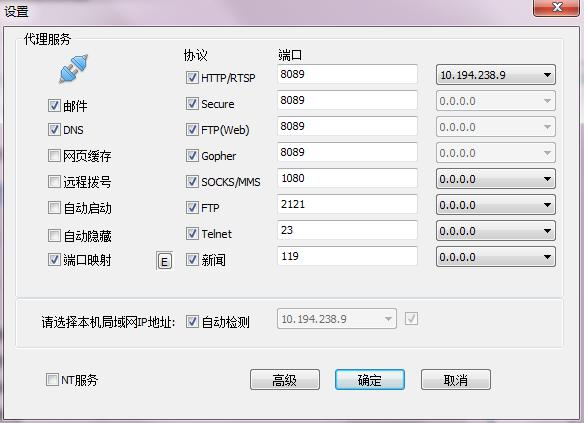
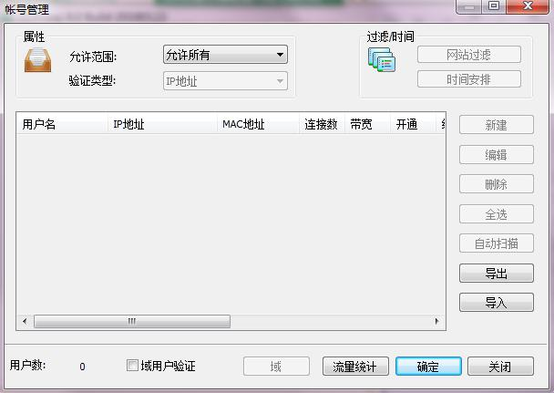

- 代理服务器选择了CCproxy，下载并安装CCProxy，配置所要代理的协议，并选择能够联外网的网卡ip；



- 账号管理根据个人需要进行配置，我这边选择的是允许所有（建议最好为虚拟机配置账号，方便以后调试和监控）。



- 在CentOS中配置全局代理

```
vim /etc/profile

export http_proxy="http://202.169.100.196:8089"
export https_proxy="http://202.169.100.196:8089"
export ftp_proxy=$http_proxy

source /etc/profile
```

- 配置yum代理

```
vim /etc/yum.conf

proxy=http://202.169.100.196:8089
```

- 配置wget代理

```
vim /etc/wgetrc

http_proxy = http://202.169.100.196:8089
ftp_proxy = http://202.169.100.196:8089
https_proxy = http://202.169.100.196:8089
```

- 测试

```
curl -k https://www.baidu.com
wget https://www.baidu.com
```