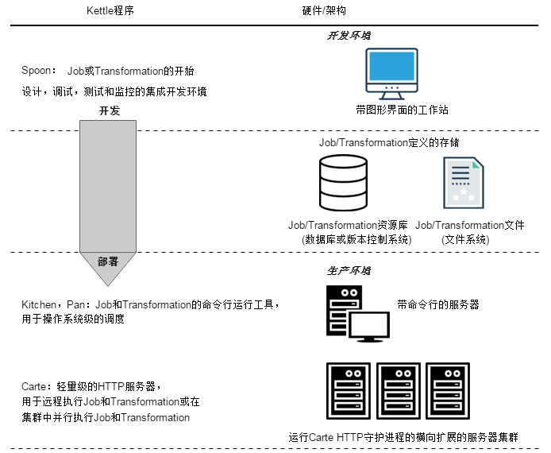
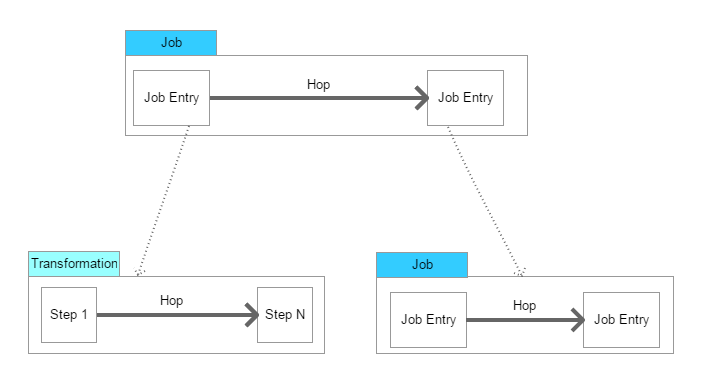
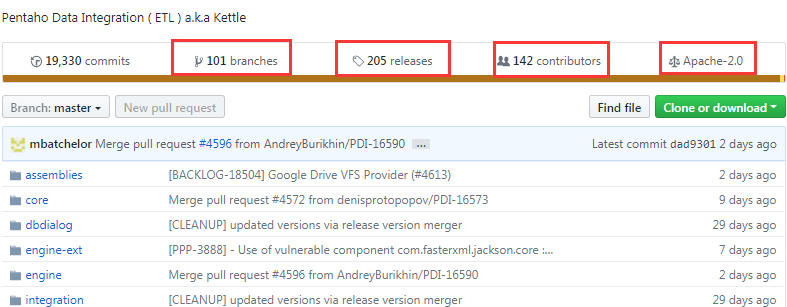

## 1 What

### 1.1 起源

Kettle是一个Java编写的ETL工具，主作者是Matt Casters，2003年就开始了这个项目，最新稳定版为7.1。
2005年12月，Kettle从2.1版本开始进入了开源领域，一直到4.1版本遵守LGPL协议，从4.2版本开始遵守Apache Licence 2.0协议。
Kettle在2006年初加入了开源的BI公司Pentaho, 正式命名为：Pentaho Data Integeration，简称“PDI”。
自2017年9月20日起，Pentaho已经被合并于日立集团下的新公司： Hitachi Vantara。
总之，Kettle可以简化数据仓库的创建，更新和维护，使用Kettle可以构建一套开源的ETL解决方案。

------

### 1.2 架构

Kettle是一个组件化的集成系统，包括如下几个主要部分：

1.Spoon：图形化界面工具(GUI方式)，Spoon允许你通过图形界面来设计Job和Transformation，可以保存为文件或者保存在数据库中，也可以直接在Spoon图形化界面中运行Job和Transformation；

2.Pan：Transformation执行器(命令行方式)，Pan用于在终端执行Transformation，没有图形界面。

3.Kitchen：Job执行器(命令行方式)，Kitchen用于在终端执行Job，没有图形界面。

4.Carte：嵌入式Web服务，用于远程执行Job或Transformation，Kettle通过Carte建立集群。

5.Encr：Kettle用于字符串加密的命令行工具，如：对在Job或Transformation中定义的数据库连接参数进行加密。

------

### 1.3 基本概念

1.Transformation：定义对数据操作的容器，数据操作就是数据从输入到输出的一个过程，可以理解为比Job粒度更小一级的容器，我们将任务分解成Job，然后需要将Job分解成一个或多个Transformation，每个Transformation只完成一部分工作。

2.Step：是Transformation内部的最小单元，每一个Step完成一个特定的功能。

3.Job：负责将Transformation组织在一起进而完成某一工作，通常我们需要把一个大的任务分解成几个逻辑上隔离的Job，当这几个Job都完成了，也就说明这项任务完成了。

4.Job Entry：Job Entry是Job内部的执行单元，每一个Job Entry用于实现特定的功能，如：验证表是否存在，发送邮件等。可以通过Job来执行另一个Job或者Transformation，也就是说Transformation和Job都可以作为Job Entry。

5.Hop：用于在Transformation中连接Step，或者在Job中连接Job Entry，是一个数据流的图形化表示。

------

## 2 Why

### 2.1 组件对比

目前，ETL工具的典型代表有:

- 商业软件：Informatica PowerCenter，IBM InfoSphere DataStage，Oracle Data Integrator，Microsoft SQL Server Integration Services等
- 开源软件：Kettle，Talend，Apatar，Scriptella等

纯java编写，可以跨平台运行，绿色无需安装，数据抽取高效稳定。

相对于传统的商业软件，Kettle是一个易于使用的，低成本的解决方案。

Spoon是基于SWT（SWT使用了本地操作系统的组件库，性能更好，界面更符合本地操作系统的风格）开发的，支持多平台：

- Microsoft Windows: all platforms since Windows 95, including Vista
- Linux GTK: on i386 and x86_64 processors, works best on Gnome
- Apple's OSX: works both on PowerPC and Intel machines
- Solaris: using a Motif interface (GTK optional)
- AIX: using a Motif interface
- HP-UX: using a Motif interface (GTK optional)
- FreeBSD: preliminary support on i386, not yet on x86_64

------

### 2.2 使用场景

- Migrating data between applications or databases 在应用程序或数据库之间进行数据迁移
- Exporting data from databases to flat files 从数据库导出数据到文件
- Loading data massively into databases 导入大规模数据到数据库
- Data cleansing 数据清洗
- Integrating applications 集成应用程序

------

## 3 How

### 3.1 下载

[https://community.hds.com/docs/DOC-1009855](https://community.hds.com/docs/DOC-1009855)

------

### 3.2 安装

安装JRE1.7+（Pan需要在JRE1.7+下运行）。
Kettle免安装，在windows环境下，直接解压到指定目录即可。

------

### 3.3 部署运行

（1）在Spoon中设计Transformation和Job
运行Transformation和Job有2种方式。
方式一：直接在Spoon中运行。
方式二：在控制台终端运行（可以传递命令行参数），例如：

- 使用Pan运行Transformation：Pan.bat /file C:\\Users\\chench9\\Desktop\\Tutorial\\hello.ktr
- 使用Kitchen运行Job：Kitchen.bat /file C:\\Users\\chench9\\Desktop\\Tutorial\\hello.kjb list /norep

（2）运行结果Step Metrics解读

- Read: the number of rows coming from previous Steps.
- Written: the number of rows leaving from this Step toward the next.
- Input: the number of rows read from a file or table.
- Output: the number of rows written to a file or table.
- Errors: errors in the execution. If there are errors, the whole row will become red.

（3）Kettle Java API
可以通过Java API的方式，将Kettle与第三方应用程序集成。
Kettle本身不提供对外的REST API，但是有一个Step为REST Client。
引用了Kettle所依赖的lib包之后，可以通过Java API方式在第三方应用中运行Job或Transformation

（4）集群部署
Kettle集群是一个Master/Slave架构。
Kettle集群是通过Carte服务组建的，集群模式主要用于远程执行Job。
本质上来讲Carte就是一个Web服务，其实就是使用了一个嵌入式Jetty容器。
初次调用Carte HTTP服务时用户名/密码: cluster/cluster。

------