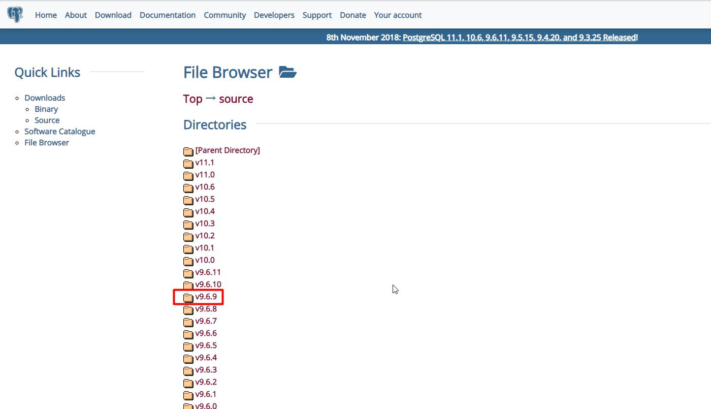
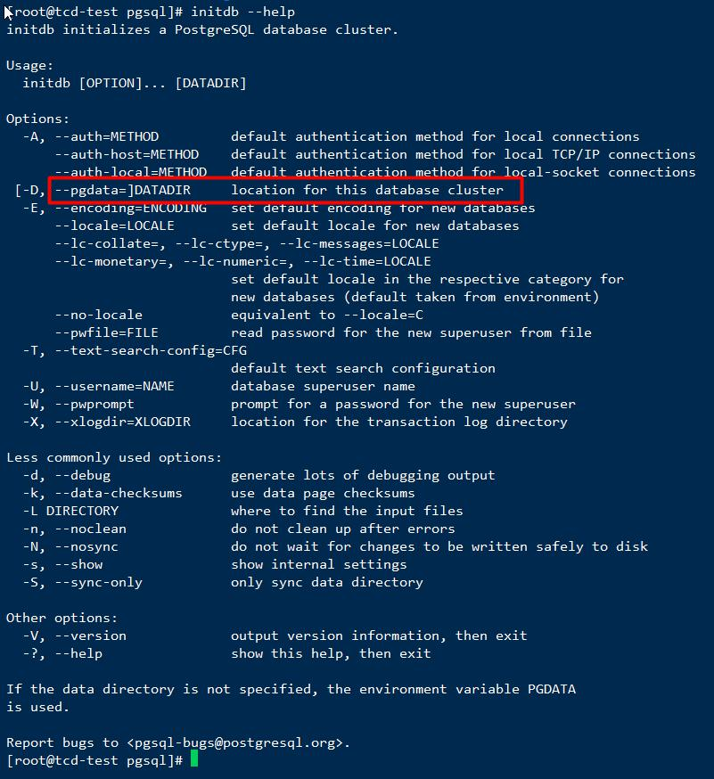
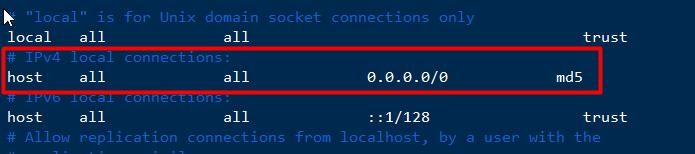
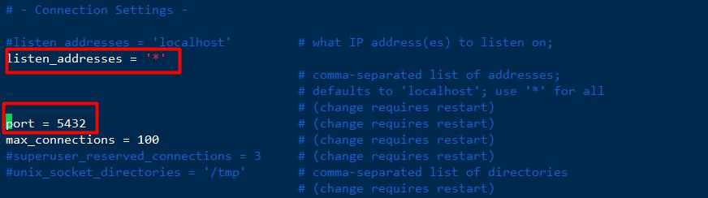
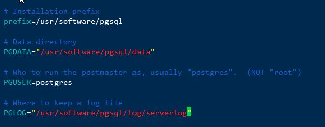
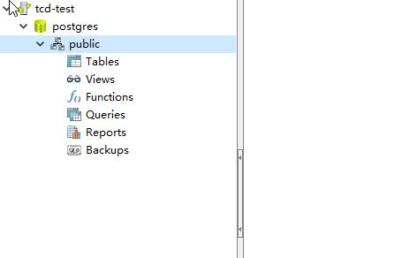

## 准备编译环境

```
# 检查服务器上是否存在gcc-c++的环境，使用命令：
rpm -qa | grep gcc-c++

# 若无，则访问镜像网站获取：http://mirrors.aliyun.com/centos/7/os/x86_64/Packages/

rpm -Uvh *.rpm --nodeps --force

# 查看gcc版本和g++版本，会看到详细的版本信息，安装完成

gcc -v
g++ -v

```

## 编译postgresql源码包，并安装

访问 https://www.postgresql.org/ftp/source/，选择对应版本：



点击之后，下载对应的tar.gz源码包，然后将其上传到服务器指定路径。

```
[root@test postgresql]# tar -zvxf postgresql-9.6.9.tar.gz 

# 进入解压后目录，通过命令 ./configure --help 可以看到配置相关的帮助信息
[root@test postgresql]# cd postgresql-9.6.9/
[root@test postgresql-9.6.9]# ./configure --help

# 其中，--prefix=dir 可以指定安装目录：
[root@test software]# mkdir pgsql

[root@test postgresql-9.6.9]# ./configure --prefix=/usr/software/pgsql

# 此时，会报以下错误：

configure: error: readline library not found
If you have readline already installed, see config.log for details on the
failure.  It is possible the compiler isn't looking in the proper directory.
Use --without-readline to disable readline support.

# 安装缺少的包即可

[root@test outrpm]# rpm -ivh ncurses-devel-5.9-14.20130511.el7_4.x86_64.rpm 
[root@test outrpm]# rpm -ivh readline-devel-6.2-10.el7.x86_64.rpm 
[root@test outrpm]# rpm -ivh zlib-1.2.7-18.el7.x86_64.rpm 

# 安装zlib会与原来的zlib冲突
[root@test outrpm]# rpm -ivh zlib-1.2.7-18.el7.x86_64.rpm 
warning: zlib-1.2.7-18.el7.x86_64.rpm: Header V3 RSA/SHA256 Signature, key ID f4a80eb5: NOKEY
Preparing...                          ################################# [100%]
        file /usr/lib64/libz.so.1.2.7 from install of zlib-1.2.7-18.el7.x86_64 conflicts with file from package zlib-1.2.7-17.el7.x86_64

# 添加--force参数强制更新  --nodeps 为不考虑依赖
[root@test outrpm]# rpm -ivh zlib-1.2.7-18.el7.x86_64.rpm --force

[root@tcd-test outrpm]# rpm -ivh zlib-devel-1.2.7-18.el7.x86_64.rpm 

# 然后，重新注册即可
[root@test postgresql-9.6.9]# ./configure --prefix=/usr/software/pgsql
[root@tcd-test postgresql-9.6.9]# make
[root@tcd-test postgresql-9.6.9]# make install

```

## 相关配置

### 创建用户

```
[root@tcd-test ~]# groupadd postgres
[root@tcd-test ~]# useradd postgres -g postgres
[root@tcd-test ~]# passwd postgres

# 在安装目录创建data和log目录
[root@tcd-test ~]# cd /usr/software/pgsql/
[root@tcd-test pgsql]# mkdir data
[root@tcd-test pgsql]# mkdir log

# 设定权限
[root@tcd-test ~]# chown -R postgres:postgres /usr/software/pgsql/

```

### 环境变量配置

```
vim /etc/profile

# 底部添加以下内容：
export PGDATA=/usr/software/pgsql/data
export PG_HOME=/usr/software/pgsql
export PATH=$PATH:$PG_HOME/bin

source /etc/profile
```

### 初始化数据库

```
# 初始化数据库的帮助信息
[root@tcd-test pgsql]# initdb --help

```


由于之前在配置文件中已经设定了环境变量 PGDATA ，因此可以直接使用命令 initdb 来完成数据库初始化操作。

**切换为postgres用户**,初始化数据库。

注意，如果root用户下执行数据库初始化操作：

```
[root@tcd-test pgsql]# initdb 
initdb: cannot be run as root
Please log in (using, e.g., "su") as the (unprivileged) user that will
own the server process.

[root@tcd-test pgsql]# su postgres
[postgres@tcd-test pgsql]$ initdb 

```

### 配置数据库

进入*/pgsql/data 目录，使用命令vim pg_hba.conf，配置对数据库的访问控制(设置为可以通过密码访问);

```
[postgres@tcd-test pgsql]$ cd /usr/software/pgsql/data
[postgres@tcd-test data]$ vim ./pg_hba.conf 

```



```
[postgres@tcd-test data]$ vim ./postgresql.conf 

```



### 关闭防火墙(root用户)

```
# 查看防火墙状态
systemctl status firewalld
# 关闭防火墙
systemctl stop firewalld
# 设置开机不启动
systemctl disable firewalld
```

### 配置系统服务(root用户)

进入postgresql源码包的解压目录；

执行命令 cp contrib/start-scripts/linux /etc/init.d/postgresql；

然后vim /etc/init.d/postgresql，进行配置修改：

```
[root@tcd-test ~]# cd /usr/software/postgresql/postgresql-9.6.9/
[root@tcd-test postgresql-9.6.9]# cp contrib/start-scripts/linux /etc/init.d/postgresql
vim /etc/init.d/postgresql

```



使用命令chmod +x /etc/init.d/postgresql，赋予该文件执行权限;

另外，还可以使用命令chkconfig --add postgresql，设置服务开机自启。

## 启动

### 启动数据库服务

```
[root@tcd-test ~]# service postgresql status
pg_ctl: no server running
[root@tcd-test ~]# service postgresql start
Starting PostgreSQL: ok

```

### 本地连接

启动成功后，可以通过postgresql自带的客户端工具psql来进行连接；

postgresql用户直接输入psql看到版本信息则说明连接成功。

然后，使用 “\password”，设置密码。

```
[root@tcd-test ~]# su postgres
[postgres@tcd-test root]$ psql
could not change directory to "/root": Permission denied
psql (9.6.9)
Type "help" for help.

postgres=# \password
Enter new password: 
Enter it again: 
postgres=# 
postgres=# \l
                                  List of databases
   Name    |  Owner   | Encoding |   Collate   |    Ctype    |   Access privileges   
-----------+----------+----------+-------------+-------------+-----------------------
 postgres  | postgres | UTF8     | en_US.UTF-8 | en_US.UTF-8 | 
 template0 | postgres | UTF8     | en_US.UTF-8 | en_US.UTF-8 | =c/postgres          +
           |          |          |             |             | postgres=CTc/postgres
 template1 | postgres | UTF8     | en_US.UTF-8 | en_US.UTF-8 | =c/postgres          +
           |          |          |             |             | postgres=CTc/postgres
(3 rows)

```

### 远程连接



