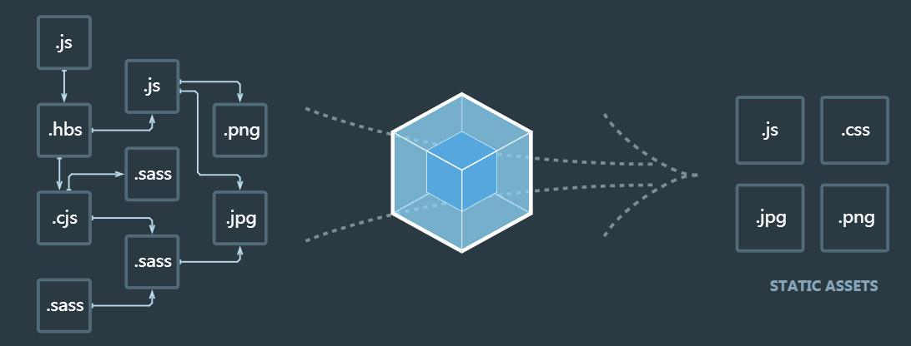

> Webpack是一个前端资源加载/打包工具。它将根据模块的依赖关系进行静态分析，然后将这些模块按照指定的规则生成对应的静态资源。
> 本章节基于Webpack4.29.3 测试通过。



从图中我们可以看出，Webpack 可以将多种静态资源 js、css、less 转换成一个静态文件，减少了页面的请求。

------

## 1 HelloWorld

### 1.1 安装 Webpack

在安装Webpack前，你本地环境需要支持node.js。

由于npm安装速度慢，本教程使用了淘宝的镜像及其命令cnpm:

```
npm install cnpm -g
```

使用cnpm安装webpack：

```
cnpm install webpack -g
```

### 1.2 创建项目

接下来我们创建一个目录app：

```
mkdir app
```

在app目录下添加runoob1.js文件，代码如下：

```
document.write("It works.");
```

在app目录下添加index.html文件，代码如下：

```
<html>
    <head>
        <meta charset="utf-8">
    </head>
    <body>
        <script type="text/javascript" src="bundle.js" charset="utf-8"></script>
    </body>
</html>
```

接下来我们使用webpack命令来打包：

```
webpack runoob1.js -o bundle.js
```

执行以上命令会编译 runoob1.js 文件并生成bundle.js 文件。

### 1.3 创建第二个JS文件

接下来我们创建另外一个js文件runoob2.js，代码如下所示：

```
module.exports = "It works from runoob2.js.";
```

更新runoob1.js文件，代码如下：

```
document.write(require("./runoob2.js"));
```

webpack根据模块的依赖关系进行静态分析，这些文件(模块)会被包含到bundle.js 文件中。Webpack会给每个模块分配一个唯一的id 并通过这个id 索引和访问模块。 在页面启动时，会先执行runoob1.js中的代码，其它模块会在运行require的时候再执行。

------

## 2 LOADER

Webpack本身只能处理JavaScript模块，如果要处理其他类型的文件，就需要使用loader进行转换。

所以如果我们需要在应用中添加css文件，就需要使用到css-loader和style-loader，他们做两件不同的事情，css-loader会遍历CSS文件，然后找到url()表达式然后处理他们，style-loader会把原来的CSS代码插入页面中的一个style 标签中。

接下来我们使用以下命令来安装css-loader和style-loader(全局安装需要参数 -g)。

```
cnpm install css-loader style-loader
```

执行以上命令后，会再当前目录生成node_modules目录，它就是css-loader和style-loader的安装目录。

接下来创建一个style.css文件，代码如下：

```
body {
    background: yellow;
}
```

修改runoob1.js文件，代码如下：

```
require("!style-loader!css-loader!./style.css");
document.write(require("./runoob2.js"));
```

require CSS 文件的时候都要写loader 前缀 !style-loader!css-loader!，当然我们可以根据模块类型（扩展名）来自动绑定需要的 loader。 将runoob1.js 中的 require("!style-loader!css-loader!./style.css") 修改为 require("./style.css") ：

```
require("./style.css");
document.write(require("./runoob2.js"));
```

然后执行：

```
webpack runoob1.js bundle.js --module-bind 'css=style-loader!css-loader'
# windows下
webpack runoob1.js bundle.js --module-bind "css=style-loader!css-loader"
```

------

## 3 配置文件

我们可以将一些编译选项放在配置文件中，以便于统一管理：

创建webpack.config.js文件，代码如下所示：

```
module.exports = {
    entry: "./runoob1.js",
    output: {
        path: __dirname,
        filename: "bundle.js"
    },
    module: {
        rules: [
        {
            test: /\.css$/,
            use: [
                {loader: "style-loader"},
                {loader: "css-loader"}
            ]
        }
        ]
    }
}
```

接下来我们只需要执行webpack 命令即可生成bundle.js 文件：

```
webpack
```

webpack命令执行后，会默认载入当前目录的webpack.config.js文件。

------

## 4 插件

插件在webpack的配置信息plugins选项中指定，用于完成一些loader不能完成的工。

webpack自带一些插件，你可以通过cnpm安装一些插件。

使用内置插件需要通过以下命令来安装：

```
cnpm install webpack --save-dev
```

比如我们可以安装内置的BannerPlugin插件，用于在文件头部输出一些注释信息。

修改webpack.config.js，代码如下：

```
var webpack=require('webpack')

module.exports = {
    entry: "./runoob1.js",
    output: {
        path: __dirname,
        filename: "bundle.js"
    },
    module: {
        rules: [
        {
            test: /\.css$/,
            use: [
                {loader: "style-loader"},
                {loader: "css-loader"}
            ]
        }
        ]
    },
    plugins:[
        new webpack.BannerPlugin('菜鸟教程 webpack 实例')
    ]
}
```

然后运行:

```
webpack
```

打开 bundle.js，可以看到文件头部出现了我们指定的注释信息。

## 5 开发环境

当项目逐渐变大，webpack的编译时间会变长，可以通过参数让编译的输出内容带有进度和颜色。

```
webpack --progress --colors
```

如果不想每次修改模块后都重新编译，那么可以启动监听模式。开启监听模式后，没有变化的模块会在编译后缓存到内存中，而不会每次都被重新编译，所以监听模式的整体速度是很快的。

```
webpack --progress --colors --watch
```

当然，我们可以使用webpack-dev-server开发服务，这样我们就能通过localhost:8080启动一个 express静态资源web服务器，并且会以监听模式自动运行webpack，在浏览器打开http://localhost:8080/或http://localhost:8080/webpack-dev-server/可以浏览项目中的页面和编译后的资源输出，并且通过一个socket.io服务实时监听它们的变化并自动刷新页面。

```
# 安装
cnpm install webpack-dev-server -g
 
# 运行
webpack-dev-server --progress --colors
```

## 6 常见问题

- windows下--module-bind绑定css loader失败

windows需要用双引号把css=style-loader！css-loader包起来，linux下用单引号。